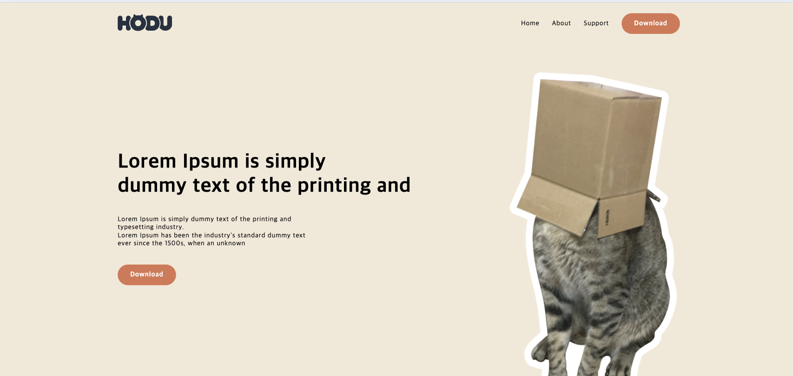
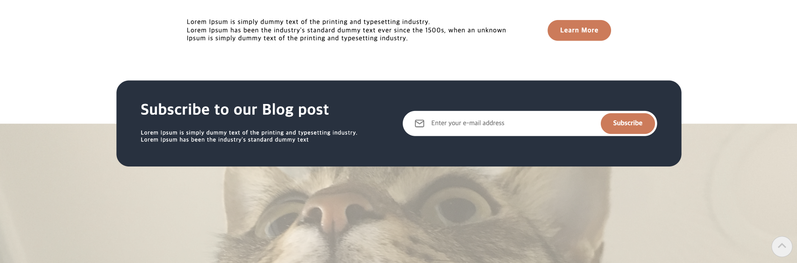

# 🐈 hodu-randing-page
__HODU__ 는 귀여운 고양이 "hodu"를 테마로 한 랜딩 페이지입니다. HTML, CSS로 구성되어 있으며 내용 측면에서는 수정이 필요합니다.

 

---

## 🔗 배포 URL
[https://nguswjd.github.io/hodu-randing-page/]

 

---

## 📺 화면 구성
|header|
|:---:|
||
|상단에는 로고 및 nav 요소와 페이지의 주요 콘텐츠를 담는 영역입니다.|

|main section 1|
|:---:|
||
|main 섹션에 처음으로 보이는 부분으로   웹페이지의 주제를 담는 영역입니다.|

|main section 2|
|:---:|
||
|main 섹션 중간 영역으로 웹페이지의 주요 콘텐츠를 담는 영역입니다.   이미지는 크기가 작아지면서 좌우 스크롤을 할 수있습니다.|

|main section 3 + 4|
|:---:|
||
|main 섹션 하단 부분으로 페이지 더알아보기 링크와   관리자의 blog를 구독할 수 있게 연결할 수 있는 링크창이 있습니다.|

|footer|
|:---:|
||
|하단 푸터로 페이지의 로고와 바로가기 링크,   모바일 화면에서는 추가적인 네비게이션이 있습니다.|

 

---

## ⚙️ 기술 스택
### Front-end

  
  

### Tools

  
  

 

---

## 🧬 프로젝트 구조
📦hodu-randing-page  
┣ 📂css  
┣ 📂image  
┃ ┣ 📜index.html  
┃ ┣ 📜style.html   
┣ 📂js  
┃ ┣ 📜jquery.html  
┃ ┣ 📜script.html  
┣ 📂readme-image    
┣ 📜index.html    
┗ 📜README.md

 

---
## ⚒️ 기술적 이슈와 해결 과정
- `img-container`에 스크롤를 구현하던 중, 상위 부모 요소에 `align-items: center;` 속성을 적용하면  `img-container`에 설정한 `overflow: auto`가 동작하지 않는 문제가 발생했습니다. 이를 해결하기 위해 `align-items: center;`를 사용하여 pc 환경에서 화면 기준 가운데 정렬이 적용되게 구현하였고, `img-container`의 총 너비가 화면을 초과하기 전 미디어 쿼리를 이용하여 `align-items: center;`값을 `unset`으로 바꿔주어 `overflow: auto`로 좌우간 스크롤이 적용될 수 있게 해결하였습니다.

---
## jQuery
|모바일 환경 Tabmenu|
|:---:|
||
|모바일 환경에서 tab 메뉴를 열고 닫을 때   `sr-only`클래스를 추가 제거 하여 열고 닫는 버튼을 구현하였습니다.|

|이메일 입력, 모달창|
|:---:|
||
|사용자가 이메일을 등록할 떄 이메일 형식에 `@`이나 `.`이 없을 경우   "이메일 형식을 확인하세요!"라는 경고창이 뜹니다.   만약 `@`이나 `.`가 있을 경우   모달창에 `class = "hidden"`을 제거하여 모달창을 띄우고   모달창의 주황색 버튼을 누르면 `class = "hidden"`를 추가하여   모달창이 보이지 않도록 구현하였습니다.|

|스크롤 탑 버튼|
|:---:|
||
|사용자가 top버튼을 누를 경우 페이지 상단으로 올라갑니다.|
